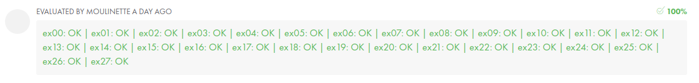
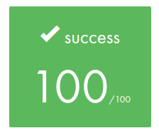

<div id="top"></div>
<!--
*** Thanks for checking out the Best-README-Template. If you have a suggestion
*** that would make this better, please fork the repo and create a pull request
*** or simply open an issue with the tag "enhancement".
*** Don't forget to give the project a star!
*** Thanks again! Now go create something AMAZING! :D
-->

<!-- PROJECT LOGO -->
<br />
<div align="center">
  <h1 style="padding:16px;">Basecamp Reload - 42 São Paulo</h1>
  <a href="https://github.com/brunobonaldi94">
    
  </a>
  <p>Just a reminder - main concepts learned during in Basecamp</p>
</div>

<!-- TABLE OF CONTENTS -->
<details>
  <summary>Table of Contents</summary>
  <ol>
    <li>
      <a href="#about-the-project">About The Project</a>
    </li>
    <li>
      <a href="#exercises">Exercises</a>
    </li>
    <li><a href="#final_result">Final Result</a></li>
    <li><a href="#about_42">About 42</a></li>
  </ol>
</details>


<!-- ABOUT THE PROJECT -->
<h1 id="about-the-project" style="padding:16px 4px;
		border-top:0.5px solid rgba(255,255,255,0.20);">About The Project</h1>

<p style="padding:0 8px;">
	As the course starts approximately after 1 month of 42 São Paulo Basecamp,
	these exercises are just a reminder of the main concepts learned (C language and Shell) during the Basecamp.
</p>
<p align="right">(<a href="#top">back to top</a>)</p>


<h1 id="exercises" style="padding:16px 4px;
		border-top:0.5px solid rgba(255,255,255,0.20);">Exercises</h1>

<p style="padding:0 8px;">
Below there is a short description about each exercise and the main concepts behind each one.
Some functions use <i>ft_putchar</i> function, which is implemented as below:</p>

```c
#include <unistd.h>

void	ft_putchar(char c)
{
	write(1, &c, 1);
}

```
## Also these exercises must be aligned with [The Norm](https://github.com/42School/norminette).

<p align="right">(<a href="#top">back to top</a>)</p>

<table style="width:100%;">
	<thead>
		<tr>
			<th style="text-align:center;">#</th>
			<th style="text-align:center;">Ex</th>
			<th style="text-align:center;">Language</th>
			<th style="text-align:center;">Short Desc</th>
			<th style="text-align:center;">Main Concepts / Commands</th>
			<th style="text-align:center;">Result</th>
		</tr>
	</thead>
	<tbody>
		<tr sty>
			<td style="text-align:center;">00</td>
			<td style="text-align:center;">
				<a href="ex00">Oh yeah, mooore...</a>
			</td>
			<td style="text-align:center;">Shell</td>
			<td style="text-align:center;">Create files and directories, change permisson, modify date and time, hard and soft link, etc.</td>
			<td style="text-align:center;"><i>ls, cd, mkdir, chmod, ln, touch (-h, -t) ...</i></td>
			<td style="display:flex;
		align-items:center;" align="center"><span style="margin-right:8px;">Success (100%)</span></td>
		</tr>
		<tr>
			<td style="text-align:center;">01</td>
			<td style="text-align:center;">
				<a href="ex01">Z</a>
			</td>
			<td style="text-align:center;">Shell</td>
			<td style="text-align:center;">Create a file called z with "Z" inside it.</td>
			<td style="text-align:center;"><i>cat, echo </i></td>
			<td style="display:flex;align-items:center;" align="center"><span style="margin-right:8px;">Success (100%)</span></td>
		</tr>
		<tr>
			<td style="text-align:center;">02</td>
			<td style="text-align:center;">
				<a href="ex02">clean</a>
			</td>
			<td style="text-align:center;">Shell</td>
			<td style="text-align:center;">Create a command to find and remove files following a specific pattern</td>
			<td style="text-align:center;"><i>find</i></td>
			<td style="display:flex;align-items:center;" align="center"><span style="margin-right:8px;">Success (100%)</span></td>
		</tr>
		<tr>
			<td style="text-align:center;">03</td>
			<td style="text-align:center;">
				<a href="ex03">find_sh</a>
			</td>
			<td style="text-align:center;">Shell</td>
			<td style="text-align:center;">Find all the files with .sh extension of a directory and display only the basename</td>
			<td style="text-align:center;"><i>find -exec</i></td>
			<td style="display:flex;align-items:center;" align="center"><span style="margin-right:8px;">Success (100%)</span></td>
		</tr>
		<tr>
			<td style="text-align:center;">04</td>
			<td style="text-align:center;">
				<a href="ex04">MAC</a>
			</td>
			<td style="text-align:center;">Shell</td>
			<td style="text-align:center;">Display only the MAC address</td>
			<td style="text-align:center;"><i>ifconfig, grep, sed, cut</i></td>
			<td style="display:flex;align-items:center;" align="center"><span style="margin-right:8px;">Success (100%)</span></td>
		</tr>
		<tr>
			<td style="text-align:center;">05</td>
			<td style="text-align:center;">
				<a href="ex05">Can you create it?</a>
			</td>
			<td style="text-align:center;">Shell</td>
			<td style="text-align:center;">Create a file with a name with several special characters</td>
			<td style="text-align:center;"><i>find</i></td>
			<td style="display:flex;align-items:center;" align="center"><span style="margin-right:8px;">Success (100%)</span></td>
		</tr>
		<tr>
			<td style="text-align:center;">06</td>
			<td style="text-align:center;">
				<a href="ex06">ft_print_alphabet</a>
			</td>
			<td style="text-align:center;">C</td>
			<td style="text-align:center;">Print all alphabet in lowercase</td>
			<td style="text-align:center;"><i>ft_putchar, while</i></td>
			<td style="display:flex;align-items:center;" align="center"><span style="margin-right:8px;">Success (100%)</span></td>
		</tr>
		<tr>
			<td style="text-align:center;">07</td>
			<td style="text-align:center;">
				<a href="ex07">ft_print_numbers</a>
			</td>
			<td style="text-align:center;">C</td>
			<td style="text-align:center;">Print all numbers</td>
			<td style="text-align:center;"><i>ft_putchar, while</i></td>
			<td style="display:flex;align-items:center;" align="center"><span style="margin-right:8px;">Success (100%)</span></td>
		</tr>
				<tr>
			<td style="text-align:center;">08</td>
			<td style="text-align:center;">
				<a href="ex08">ft_is_negative</a>
			</td>
			<td style="text-align:center;">C</td>
			<td style="text-align:center;">Print with number is positive or negative</td>
			<td style="text-align:center;"><i>ft_putchar, while, if</i></td>
			<td style="display:flex;align-items:center;" align="center"><span style="margin-right:8px;">Success (100%)</span></td>
		</tr>
		<tr>
			<td style="text-align:center;">09</td>
			<td style="text-align:center;">
				<a href="ex09">ft_ft</a>
			</td>
			<td style="text-align:center;">C</td>
			<td style="text-align:center;">Change int variable value using pointer</td>
			<td style="text-align:center;"><i>Indirection Operator (*)</i></td>
			<td style="display:flex;align-items:center;" align="center"><span style="margin-right:8px;">Success (100%)</span></td>
		</tr>
		<tr>
			<td style="text-align:center;">10</td>
			<td style="text-align:center;">
				<a href="ex10">ft_swap</a>
			</td>
			<td style="text-align:center;">C</td>
			<td style="text-align:center;">Swap the value of two int variables using pointer</td>
			<td style="text-align:center;"><i>Indirection Operator (*)</i></td>
			<td style="display:flex;align-items:center;" align="center"><span style="margin-right:8px;">Success (100%)</span></td>
		</tr>
		<tr>
			<td style="text-align:center;">11</td>
			<td style="text-align:center;">
				<a href="ex11">ft_div_mod</a>
			</td>
			<td style="text-align:center;">C</td>
			<td style="text-align:center;">Calculate div and mod of two variables and change their values using pointer</td>
			<td style="text-align:center;"><i>Indirection Operator (*), "%" and "/" operators </i></td>
			<td style="display:flex;align-items:center;" align="center"><span style="margin-right:8px;">Success (100%)</span></td>
		</tr>
		<tr>
			<td style="text-align:center;">12</td>
			<td style="text-align:center;">
				<a href="ex12">ft_iterative_factorial</a>
			</td>
			<td style="text-align:center;">C</td>
			<td style="text-align:center;">Create an interative (loop) factorial function</td>
			<td style="text-align:center;"><i>while, "*" operator, if</i></td>
			<td style="display:flex;align-items:center;" align="center"><span style="margin-right:8px;">Success (100%)</span></td>
		</tr>
		<tr>
			<td style="text-align:center;">13</td>
			<td style="text-align:center;">
				<a href="ex13">ft_recursive_factorial</a>
			</td>
			<td style="text-align:center;">C</td>
			<td style="text-align:center;">Create an recursive factorial function</td>
			<td style="text-align:center;"><i>recursion, "*" operator, if</i></td>
			<td style="display:flex;align-items:center;" align="center"><span style="margin-right:8px;">Success (100%)</span></td>
		</tr>
		<tr>
			<td style="text-align:center;">14</td>
			<td style="text-align:center;">
				<a href="ex14">ft_sqrt</a>
			</td>
			<td style="text-align:center;">C</td>
			<td style="text-align:center;">Create sqrt algorithm (natural numbers)</td>
			<td style="text-align:center;"><i>while, binary search concept</i></td>
			<td style="display:flex;align-items:center;" align="center"><span style="margin-right:8px;">Success (100%)</span></td>
		</tr>
		<tr>
			<td style="text-align:center;">15</td>
			<td style="text-align:center;">
				<a href="ex15">ft_putstr</a>
			</td>
			<td style="text-align:center;">C</td>
			<td style="text-align:center;">Print a string</td>
			<td style="text-align:center;"><i>ft_putchar, while</i></td>
			<td style="display:flex;align-items:center;" align="center"><span style="margin-right:8px;">Success (100%)</span></td>
		</tr>
		<tr>
			<td style="text-align:center;">16</td>
			<td style="text-align:center;">
				<a href="ex16">ft_strlen</a>
			</td>
			<td style="text-align:center;">C</td>
			<td style="text-align:center;">Calculate string length</td>
			<td style="text-align:center;"><i>while</i></td>
			<td style="display:flex;align-items:center;" align="center"><span style="margin-right:8px;">Success (100%)</span></td>
		</tr>
		<tr>
			<td style="text-align:center;">17</td>
			<td style="text-align:center;">
				<a href="ex17">ft_strcmp</a>
			</td>
			<td style="text-align:center;">C</td>
			<td style="text-align:center;">Reproduce strcmp function behavior</td>
			<td style="text-align:center;"><i>while</i></td>
			<td style="display:flex;align-items:center;" align="center"><span style="margin-right:8px;">Success (100%)</span></td>
		</tr>
				<tr>
			<td style="text-align:center;">18</td>
			<td style="text-align:center;">
				<a href="ex18">ft_print_params</a>
			</td>
			<td style="text-align:center;">C</td>
			<td style="text-align:center;">Create a program that print all arguments received from terminal</td>
			<td style="text-align:center;"><i>argc, argv, ft_putchar, while</i></td>
			<td style="display:flex;align-items:center;" align="center"><span style="margin-right:8px;">Success (100%)</span></td>
		</tr>
				<tr>
			<td style="text-align:center;">19</td>
			<td style="text-align:center;">
				<a href="ex19">ft_sort_params</a>
			</td>
			<td style="text-align:center;">C</td>
			<td style="text-align:center;">Create a program that sort and print all arguments by ascii order received from terminal</td>
			<td style="text-align:center;"><i>argc, argv, ft_putchar, while, ft_strcmp</i></td>
			<td style="display:flex;align-items:center;" align="center"><span style="margin-right:8px;">Success (100%)</span></td>
		</tr>
		<tr>
			<td style="text-align:center;">20</td>
			<td style="text-align:center;">
				<a href="ex20">ft_strdup</a>
			</td>
			<td style="text-align:center;">C</td>
			<td style="text-align:center;">Create a function that duplicates a string</td>
			<td style="text-align:center;"><i>malloc, while , ft_strcpy, ft_strlen, sizeof</i></td>
			<td style="display:flex;align-items:center;" align="center"><span style="margin-right:8px;">Success (100%)</span></td>
		</tr>
		<tr>
			<td style="text-align:center;">21</td>
			<td style="text-align:center;">
				<a href="ex21">ft_range</a>
			</td>
			<td style="text-align:center;">C</td>
			<td style="text-align:center;">Create a function ft_range which returns an array ofints with all values between min (included) and max (excluded)</td>
			<td style="text-align:center;"><i>malloc, while</i></td>
			<td style="display:flex;align-items:center;" align="center"><span style="margin-right:8px;">Success (100%)</span></td>
		</tr>
		<tr>
			<td style="text-align:center;">22</td>
			<td style="text-align:center;">
				<a href="ex22">ft_abs.h</a>
			</td>
			<td style="text-align:center;">C</td>
			<td style="text-align:center;">Create a macro ABS which replaces an argument by its absolute value</td>
			<td style="text-align:center;"><i>macro, ternary, header</i></td>
			<td style="display:flex;align-items:center;" align="center"><span style="margin-right:8px;">Success (100%)</span></td>
		</tr>
		<tr>
			<td style="text-align:center;">23</td>
			<td style="text-align:center;">
				<a href="ex23">ft_point.h</a>
			</td>
			<td style="text-align:center;">C</td>
			<td style="text-align:center;">Create a command to find and remove files following a specific pattern</td>
			<td style="text-align:center;"><i>struct, typedef, header</i></td>
			<td style="display:flex;align-items:center;" align="center"><span style="margin-right:8px;">Success (100%)</span></td>
		</tr>
		<tr>
			<td style="text-align:center;">24</td>
			<td style="text-align:center;">
				<a href="ex24">Makefile</a>
			</td>
			<td style="text-align:center;">Makefile</td>
			<td style="text-align:center;">Create the Makefile that’ll compile your libft.a</td>
			<td style="text-align:center;"><i>make</i></td>
			<td style="display:flex;align-items:center;" align="center"><span style="margin-right:8px;">Success (100%)</span></td>
		</tr>
			<tr>
			<td style="text-align:center;">25</td>
			<td style="text-align:center;">
				<a href="ex25">ft_foreach</a>
			</td>
			<td style="text-align:center;">C</td>
			<td style="text-align:center;">Create the function ft_foreach which, for a given ints array, applies a function on all elements of the array</td>
			<td style="text-align:center;"><i>while, passing function as parameter</i></td>
			<td style="display:flex;align-items:center;" align="center"><span style="margin-right:8px;">Success (100%)</span></td>
		</tr>
			<tr>
			<td style="text-align:center;">26</td>
			<td style="text-align:center;">
				<a href="ex26">ft_count_if</a>
			</td>
			<td style="text-align:center;">C</td>
			<td style="text-align:center;">Create a function ft_count_if which will return the number of elements of thearray that return 1</td>
			<td style="text-align:center;"><i>while, passing function as parameter</i></td>
			<td style="display:flex;align-items:center;" align="center"><span style="margin-right:8px;">Success (100%)</span></td>
		</tr>
		<tr>
			<td style="text-align:center;">27</td>
			<td style="text-align:center;">
				<a href="ex27">display_file</a>
			</td>
			<td style="text-align:center;">C, Makefile</td>
			<td style="text-align:center;">Create a program called ft_display_file that displays, on the standard output, only the content of the file given as argument</td>
			<td style="text-align:center;"><i>close, open, read, write, Makefile</i></td>
			<td style="display:flex;align-items:center;" align="center"><span style="margin-right:8px;">Success (100%)</span></td>
		 </tr>
	</tbody>
</table>
<div style="width:100%;
		display:flex;flex-direction:column;
		align-items:center;justify-content:center; margin:16px 0">
	<h1 id="final_result" style="width:100%">Final Result</h1>
	<div style="width:100%;
		display:flex;
		flex-direction:column;
		align-items:center;
		justify-content:center;">
		
		
	</div>
</div>
<h1 id="about_42" style="width:100%;
		border-top:0.5px solid rgba(255,255,255,0.20);
		padding:16px 0;">About 42</h1>
<div style="width:100%;
		display:flex;
		flex-direction:column;
		align-items:center;
		justify-content:center;">
	
</div>
<p style="padding:0 8px;">
42 is a future-proof computer science training to educate the next generation of software engineers. The 42 program takes a project-based approach to progress and is designed to develop technical and people skills that match the expectations of the labor market.
</p>
<p style="padding:0 8px;">
To join 42, you must pass in a selection process called "Piscine"or "Basecamp".
</p>
<p style="padding:0 8px;">42 São Paulo is part of 42 School network, for more information please access this link below:
<h3  style="font-size:24px;padding:0 8px;"><a href="https://www.42sp.org.br/">
42-São Paulo
</a></h3></p>

<p align="right">(<a href="#top">back to top</a>)</p>